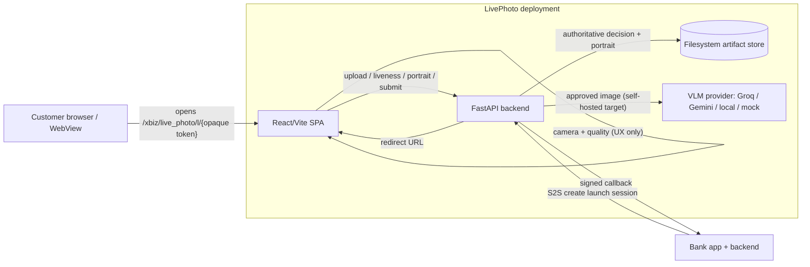
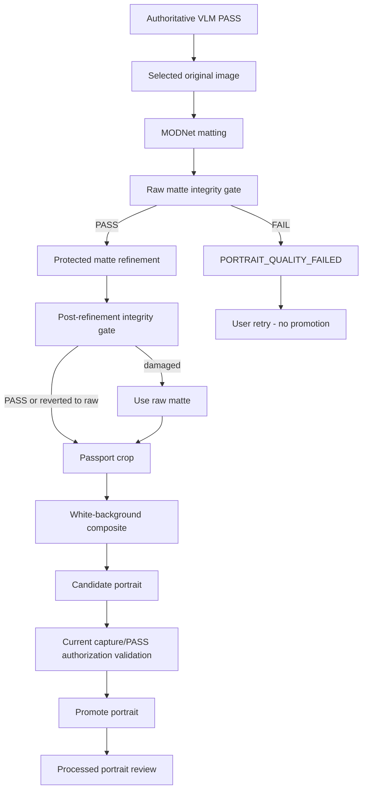

# LivePhoto — Current Application Architecture

Status: **LIVING DOCUMENT — describes what is implemented today.** It is updated whenever a change
affects application flow, user journey, model pipeline, decision flow, authority boundaries,
integration flow, transaction/artifact flow, retry/failure flow, or deployment/runtime architecture
(see the Architecture Documentation Rule in `AGENTS.md`).

> Future/planned work is **never** mixed into this document. Planned items live in
> `docs/FEATURE_FLOW_ARCHITECTURE.md` under `Next candidate improvement` and are explicitly labelled
> `NOT IMPLEMENTED`.

---

## 1. What LivePhoto is

A banking-oriented **passive-liveness face-photo platform**. A consumer app (bank) sends a customer
through a hosted browser flow; LivePhoto captures a short burst, validates image quality in the
browser, uploads one selected original, runs a **backend-authoritative VLM liveness/person-state
decision**, processes a portrait, lets the customer review it, then submits the result to the bank
via callback and redirects the customer back.

- **Backend:** Python 3.13 / FastAPI (`backend/`).
- **Frontend:** React / TypeScript / Vite (`frontend/`).
- **Storage:** filesystem-backed, one folder per transaction (`FILE_STORAGE_ROOT`).
- **No database blobs / object storage is used for artifacts** in the current implementation.

---

## 2. System context



Trust posture in one line: **everything that authorizes a PASS is decided and persisted server-side;
the browser is UX and evidence-gathering only.**

---

## 3. Components

| Component | Responsibility | Trust zone |
|---|---|---|
| React/Vite SPA | Camera access, capture guidance, browser/network preflight, preliminary quality, portrait review, redirect | Public / untrusted |
| FastAPI backend | Launch/session lifecycle, capture intake, VLM orchestration, canonical decision, portrait pipeline, callback, persistence | Internet-facing edge, authoritative |
| VLM providers (`app/providers/vision/**`) | Produce normalized liveness evidence (classification, subject_count, secondary_person_state) | Evidence only; configured server-side |
| `app/experiments/vlm/liveness.py` | **Authoritative** mapping of VLM evidence → outcome, capture binding, single-flight, stale handling, portrait authorization | Internal, authoritative |
| `app/transactions/**` | Canonical decision record, transaction statuses, filesystem artifact store, transaction IDs | Internal |
| `app/portrait/**` | Deterministic matting → integrity gate → refinement → crop → composite | Internal; quality validation |
| `app/integrations/**` | Launch tokens, browser sessions, S2S auth, consumer profiles, attempts, callback, status | Internal |
| Filesystem store | `<root>/transactions/<transaction_id>/…` artifacts; `index/` token/session/external maps | Internal data zone |
| Observability | structlog JSON logs, Prometheus metrics, optional OTel spans | Internal |

---

## 4. End-to-end flows

### 4.1 Integrated flow — `POST /api/v1/integration/launch-sessions` → `/xbiz/live_photo`

```mermaid
sequenceDiagram
    participant Bank
    participant API as LivePhoto API
    participant Browser as LivePhoto SPA
    participant VLM as VLM provider

    Bank->>API: POST /integration/launch-sessions (S2S)
    API-->>Bank: launch URL (/xbiz/live_photo/l/{opaque token})
    Bank-->>Browser: redirect customer to launch URL
    Browser->>API: GET /xbiz/live_photo/l/{token}
    API-->>Browser: session cookie + CSRF; redeem token
    Browser->>Browser: network/browser/version preflight
    Browser->>Browser: camera permission + burst + quality
    Browser->>API: POST /browser/attempts (browser evidence, allowlisted)
    Browser->>API: POST /browser/capture (selected original + face box)
    Browser->>API: POST /browser/liveness
    API->>VLM: evaluate capture (server-side only)
    VLM-->>API: classification + subject_count + secondary_person_state
    API-->>Browser: outcome + portrait_allowed
    Browser->>API: POST /browser/portrait (if allowed)
    API-->>Browser: processed portrait
    Browser->>Browser: customer reviews portrait
    Browser->>API: POST /browser/submit
    API->>Bank: signed callback (Idempotency-Key)
    API-->>Browser: validated redirect URL
```

Key endpoints (all under `backend/app/api/`):

| Endpoint | Purpose |
|---|---|
| `POST /api/v1/integration/launch-sessions` | S2S create launch session (external ID preserved verbatim) |
| `POST /api/v1/integration/transactions/{external_id}/launch-sessions` | Re-issue launch for an existing consumer transaction |
| `GET /api/v1/integration/transactions/{external_id}/status` | Consumer-scoped status |
| `GET /xbiz/live_photo/l/{token}` | Redeem opaque launch token → browser session cookie + CSRF |
| `GET /api/v1/browser/session` | Current session/flow state |
| `POST /api/v1/browser/attempts` | Register one capture attempt (allowlisted evidence only) |
| `POST /api/v1/browser/capture` | Upload selected original + normalized face box |
| `POST /api/v1/browser/liveness` | Run authoritative VLM and persist the canonical decision |
| `POST /api/v1/browser/portrait` | Run portrait pipeline under authorization + single-flight |
| `GET /api/v1/browser/portrait` | Display authorized processed portrait |
| `POST /api/v1/browser/submit` | Verify canonical PASS + portrait, callback, redirect |

### 4.2 Standalone flow — `/capture` (experiment / diagnostics)

- Endpoints: `POST /api/v1/transactions`, `POST /api/v1/transactions/{id}/liveness`,
  `POST /api/v1/transactions/{id}/portrait`, `GET /api/v1/transactions/{id}/artifacts/{type}`.
- **Experiment-gated** (`_guard_experiment`): hard-blocked in production; UAT only when explicitly
  enabled. It does **not** write a canonical decision, does **not** call back, and does **not**
  redirect. It exists for diagnostics and VLM experiments.
- It uses the same VLM mapping and the same portrait-eligibility rule as the integrated flow.

---

## 5. Frontend capture / quality (UX only)

1. **Network/browser preflight** (`ConnectivityGate`): backend `GET /api/v1/info` probe + browser
   capability detection + server-published minimum-version policy. `POLICY_UNAVAILABLE` /
   `VERSION_TOO_OLD` / `VERSION_UNKNOWN` block the flow. Browser/version detection is **explicitly
   not a security boundary**.
2. **Camera permission** → `getUserMedia` (ideal 1280×720@30, user facing) → capture is a short
   burst (8 frames / ~1200 ms, minimum 6 successful) at native video resolution.
3. **Preliminary quality** (per frame): face detection + participation (multi-face UX gate),
   exposure/contrast/sharpness, eye-open state. Reasons are hard blockers except `FACE_OFF_CENTER`.
   A bundle with no eligible frame or no eye evaluation is **not** silently passed.
4. **Selection/review**: the best eligible frame is chosen deterministically; the customer reviews
   it and confirms.
5. **Normalized face box** (`"x,y,w,h"`, clamped 0..1) is sent as **geometry guidance only** and is
   persisted with the capture for the backend integrity gate.

The browser never authorizes PASS/LIVE and never chooses the VLM provider.

---

## 6. Authoritative liveness decision (backend)

Normalized evidence (`vlm-result-v3`):

- `classification`: `LIVE | SCREEN_REPLAY | PRINT_ATTACK | QUALITY_FAILURE | UNCERTAIN`
- `subject_count`: `ZERO | ONE | MULTIPLE | UNCERTAIN`
- `secondary_person_state`: `NONE | BACKGROUND | INTERFERING | UNCERTAIN`

Decision mapping (`liveness-v3`):

| classification | subject_count | secondary_person_state | outcome |
|---|---|---|---|
| LIVE | ONE | NONE | **PASS** (portrait allowed) |
| LIVE | MULTIPLE | BACKGROUND | **PASS** (portrait allowed) |
| LIVE | ZERO | NONE | RETRY (`NO_FACE`) |
| LIVE | MULTIPLE | INTERFERING | RETRY (`MULTIPLE_FACES`) |
| LIVE | MULTIPLE | UNCERTAIN | RETRY |
| LIVE | UNCERTAIN | UNCERTAIN | RETRY |
| SCREEN_REPLAY / PRINT_ATTACK | any | any | **FAIL** |
| QUALITY_FAILURE / UNCERTAIN | any | any | RETRY |
| any missing/invalid/contradictory | — | — | RETRY (fail closed) |
| provider/network/schema error | — | — | RETRY, portrait forbidden |

**Canonical PASS is capture-bound.** The evaluation identity is derived server-side from the stored
capture (`attempt_id` + selected SHA-256). A decision authorizes only while it is the current
capture, uses the current schema/prompt, has outcome `PASS`, source `vlm`, and its own person-state
is portrait-eligible. A new capture atomically invalidates the previous decision/portrait.

---

## 7. Portrait pipeline (current implemented architecture)



- **Matting:** MODNet photographic portrait matting (ONNX Runtime, CPU-first), weights pinned by
  SHA-256, provisioned by `backend/scripts/provision-portrait-model.sh`.
- **Integrity gate (`portrait-matte-integrity-v1`, `app/portrait/integrity.py`):** deterministic,
  interpretable structural check over the primary face/head ROI using the face box as geometry
  guidance only. Metrics: face retention, expanded-head retention, left/right balance,
  primary-component face overlap. Failures are `PORTRAIT_QUALITY_FAILED` (HTTP 422, retryable).
- **Refinement protection (`matte-refinement-v3`):** if refinement fails integrity or materially
  drops face retention/balance versus the raw matte, the **raw matte is used**.
- **Crop (`passport-crop-v3`)** and **composite** produce a 3:4 portrait over the configured solid
  background; the original pixels are transformed only by alpha/crop/background. No generative
  editing is used.
- **Promotion** happens only after re-validating the current capture/PASS authorization under lock;
  stale candidates are discarded (`STALE_PORTRAIT`) and never overwrite a newer capture.

Failure path (confirmed real case): structurally invalid raw matte → `PORTRAIT_QUALITY_FAILED` →
customer retry → **no portrait promoted**. This protection is mandatory and must not be weakened.

---

## 8. Transactions, artifacts, and IDs

- **Layout:** `<FILE_STORAGE_ROOT>/transactions/<transaction_id>/` with `transaction.json`,
  `capture/`, `vlm/`, `liveness/`, `portrait/` (+ `portrait/candidates/`), `decisions/`,
  `callback/`, `attempts.json`, `launch/`, `browser/`. See `docs/TRANSACTION_FILE_STORAGE.md`.
- **Artifacts** are referenced transaction-relative; absolute paths are never exposed to the
  frontend. Reads are allowlisted by artifact type with `no-store` + `nosniff`.
- **Path safety:** transaction IDs are pattern-validated; every path is root-confined and rejects
  `..`, absolute paths, and symlink escapes. External consumer IDs are never used as filesystem
  paths (stored as `external_transaction_id`, keyed by a SHA-256 hash).
- **Internal transaction IDs:** `LP-<UTC yyyymmddThhmmssmmmZ>-<random hex>` (e.g.
  `LP-20260911T032645674Z-2822B6`). Legacy 32-hex IDs remain readable (the store accepts both
  shapes). The ID is not an authorization token.
- **Atomic writes:** metadata is written temp-file → fsync → atomic rename; per-transaction
  `fcntl` lock serializes mutations.

---

## 9. Callback / redirect

1. Submit requires a current canonical PASS **and** a current portrait authorization, else 412.
2. The portrait integrity is re-checked (JPEG SOI) before callback.
3. A stable `Idempotency-Key = sha256(consumer:external:event)` makes retries safe; an acknowledged
   callback returns the stored redirect without re-calling.
4. Transient errors (network / 429 / 5xx) retry with backoff; terminal 4xx and invalid redirects
   mark `CALLBACK_FAILED` with a retryable flag. Redirect URLs are **exact-origin** validated,
   HTTPS outside local, no userinfo/fragments; redirects are never followed by the backend.
5. On success: status `COMPLETED`, browser session revoked, validated redirect returned.

---

## 10. Trust boundaries & authority

| Boundary | Between | Posture | Controls |
|---|---|---|---|
| TB-1 | Browser ↔ LivePhoto | Untrusted | TLS; opaque session/CSRF; server authority; no PII in URLs |
| TB-2 | Bank ↔ LivePhoto API | Semi-trusted peer | S2S auth (JWT/JWKS or local-dev), allowlisted consumer policy, idempotency |
| TB-3 | Edge ↔ internal storage | Trusted after auth | Root confinement, symlink protection, allowlisted artifact reads |
| TB-4 | LivePhoto ↔ external VLM | External (POC) | Server-configured provider only; self-hosted target |
| TB-5 | Observability | Internal | Redaction, no image bytes/PII, low-cardinality labels |

Authority summary:

| Decision | Authority |
|---|---|
| Face detected / image sharp / eyes open | Browser — UX / early rejection / cost optimization only |
| `classification` / `subject_count` / `secondary_person_state` | Backend VLM (evidence) |
| Canonical `PASS` | **Backend only**, capture-bound |
| Portrait allowed | Backend only (derived from canonical outcome) |
| Portrait integrity | Backend quality validation only — never liveness/identity authority |
| Callback success | Backend only |

---

## 11. Observability

- **Logs:** structlog JSON in production; redaction for tokens/secrets/authorization/cookies; no
  image bytes, Base64, PII, or absolute filesystem paths.
- **Metrics:** HTTP request counters/histograms, VLM requests/errors/durations, launch sessions,
  capture attempts, submit results, callback events/durations, status reads. Labels are
  low-cardinality (never transaction/session/token IDs).
- **Tracing:** optional OTel `http.request` spans; disabled by default (console exporter only).

---

## 12. Deployment / runtime

- Modular monolith: one FastAPI backend + static SPA. Filesystem storage is a local directory in
  development and a mounted enterprise volume in UAT/production.
- Model weights are provisioned out-of-band into a git-ignored directory and pinned by SHA-256;
  missing/mismatched weights are typed technical errors, never silent fallbacks.
- No object storage, no database blobs, and no candidate evaluation models are part of runtime
  startup.

---

## 13. Known current limitations / not implemented

- **Manual review (REVIEW)** is a domain placeholder only; no endpoints, store, RBAC, or status
  mapping. (Future milestone.)
- **Retention/purge** is not implemented.
- **OTLP export** is not implemented (tracing console-only, default off).
- The **legacy standalone `/capture`** endpoints remain experiment-gated diagnostics, not the
  production path.
- The callback runs inline while holding the per-transaction lock (worst case can delay concurrent
  submits for that transaction).
- **Fallback segmentation is NOT implemented and NOT planned for integration yet.** An offline
  benchmark of candidate models exists (see `docs/PORTRAIT_SEGMENTATION_EVALUATION.md`); no
  fallback is wired into the customer flow.
