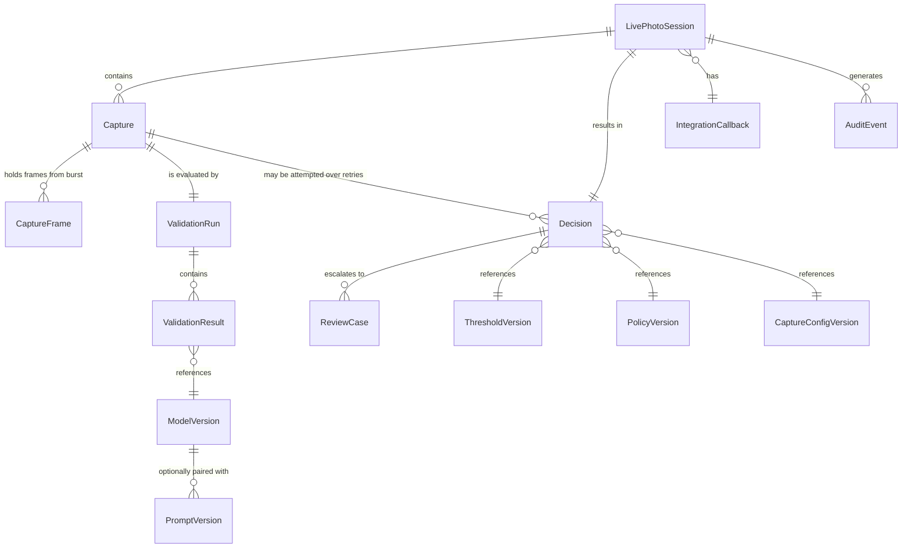

# LivePhoto — Data Model (M0 Baseline)

Status: M0 baseline. **Conceptual only — no SQL DDL in M0.** Names/relationships below are the
contract that Alembic migrations (M1+) will implement against Microsoft SQL Server.

Storage split is fixed by `ADR-006`:

- **MSSQL** stores metadata, decisions, scores, versions, audit, review, callbacks, references,
  hashes, timestamps.
- **Object storage** stores biometric image bytes (frames/final photograph).
- **No production Base64/biometric images inside primary MSSQL business tables** unless a
  separately approved requirement appears.

---

## 1. Conceptual ER (simplified)

## 2. Entities

### 2.1 LivePhotoSession
- **Responsibility:** one customer journey initiated by the bank (one `transaction_id`); owns
  lifecycle, expiry, single-use semantics, return redirect, and correlation with the bank.
- **Key fields (conceptual):** `session_id` (opaque), `bank_transaction_id`/`correlation_id`,
  `status` (`CREATED/OPEN/CAPTURING/VALIDATING/DECIDED/EXPIRED/FAILED`), `created_at`, `expires_at`,
  `return_url` (from allow-list), `capture_config_version`, `policy_version`, `auth_scope`
  (bank/client ref), `max_capture_attempts`, `attempt_count`.
- **Sensitive fields:** correlation ID (transaction metadata) — **never PII, never in URLs**.
- **Relationships:** 1→* Capture; 1→1 Decision; 1→* AuditEvent; 1→* IntegrationCallback.
- **Lifecycle:** created by authenticated S2S → opened by browser → captures → decided →
  callback → terminal.
- **Retention notes:** retained per metadata retention policy; contains no biometric bytes.

### 2.2 Capture (capture attempt)
- **Responsibility:** one submitted burst/attempt within a session (a RETRY produces a new
  Capture).
- **Key fields:** `capture_id`, `session_id`, `attempt_number`, `started_at`, `completed_at`,
  `frame_count`, `selected_frame_ref` (object key of final customer photograph), `source_hint`
  (camera-front/rear/webcam, non-authoritative), `client_telemetry` (bounded, non-authoritative).
- **Sensitive fields:** none directly; frames are referenced, not embedded.
- **Relationships:** N→1 Session; 1→* CaptureFrame; 1→1 ValidationRun (per attempt).
- **Lifecycle:** transient frames purged per retention; final selected image governed by
  biometric-image retention.

### 2.3 CaptureFrame
- **Responsibility:** a single retained burst frame.
- **Key fields:** `frame_id`, `capture_id`, `frame_index`, `object_key`, `hash`, `mime_type`,
  `size_bytes`, `capture_timestamp`, `width`/`height`, `retention_state`.
- **Sensitive fields:** references a **biometric image** in object storage (highest sensitivity).
- **Retention notes:** most frames are transient (screening discard); a configurable small subset
  is retained as audit evidence; lifecycle deletion is auditable.

### 2.4 ValidationRun
- **Responsibility:** one execution of the validation pipeline over a Capture.
- **Key fields:** `validation_run_id`, `capture_id`, `started_at`, `completed_at`,
  `orchestrator_version`, `application_version`, `status`.
- **Relationships:** 1→* ValidationResult; belongs to 1 Capture.

### 2.5 ValidationResult
- **Responsibility:** normalized output of a single validator for a run (contract in
  `VALIDATION_PIPELINE.md` §3).
- **Key fields:** `validator_name`, `validator_version`, `model_name`, `model_version`,
  `prompt_version`, `raw_score`, `calibrated_score`, `threshold`, `result`, `reason_codes`,
  `latency_ms`, `executed_at`, `input_reference`, `configuration_version`.
- **Sensitive fields:** none (no raw image bytes; `input_reference` is opaque).
- **Audit requirements:** full history retained; never overwritten.
- **Retention notes:** long-lived for investigation/model analytics.

### 2.6 Decision
- **Responsibility:** the authoritative outcome for a session.
- **Key fields:** `decision_id`, `session_id`, `capture_id` (deciding capture), `decision`
  (`PASS/RETRY/REVIEW/FAIL`), `is_live`, `liveness_score`, `risk_score`, `quality_score`,
  `fraud_attempt`, `attack_type` (nullable), `reason_codes`, `processing_time_ms`,
  `model_versions` (set), `prompt_versions`, `threshold_version`, `policy_version`,
  `capture_config_version`, `application_version`, `decided_at`.
- **Relationships:** 1→1 Session (final); may exist per attempted capture during retries.
- **Lifecycle:** immutable once written; superseded by retry only via new decision row.
- **Audit requirements:** immutable, versioned, reproducible.

### 2.7 ModelVersion
- **Responsibility:** registry of every model artifact that influenced decisions.
- **Key fields:** `model_name`, `model_version`, `provider`, `artifact_ref`, `prompt_version(s)`
  where relevant, `registered_at`, `status` (candidate/active/retired), `benchmark_ref`.
- **Retention notes:** registry is never deleted; retired models remain referenced by historical
  decisions.

### 2.8 PromptVersion
- **Responsibility:** versioned VLM prompt definitions (treated like model artifacts).
- **Key fields:** `provider`, `model`, `prompt_id`, `prompt_version`, `schema_version`,
  sampling settings, `content_ref` (config/VCS), `registered_at`, `status`.

### 2.9 ThresholdVersion
- **Responsibility:** versioned threshold + decision-mapping configuration sets.
- **Key fields:** `threshold_version`, `thresholds` (per validator), `mapping_rules`,
  `registered_at`, `status`, `benchmark_ref`.

### 2.10 PolicyVersion (config-recorded; may live with ThresholdVersion or separately)
- **Responsibility:** versioned business policy (RETRY caps, REVIEW eligibility, fail-safe
  mapping, retention defaults). Referenced by Decision.

### 2.11 ReviewCase (future, M13)
- **Responsibility:** manual-review escalation for a REVIEW (or policy-selected) decision.
- **Key fields:** `review_case_id`, `decision_id`, `reason_codes`, `risk_score`, `state`
  (`OPEN/IN_REVIEW/APPROVED/REJECTED/EXPIRED`), `assigned_reviewer`, `reviewer_decision`,
  `review_notes`, `reviewed_at`, `audit history`.
- **Sensitive fields:** exposes the selected image + validation detail — reviewer-only access.

### 2.12 AuditEvent
- **Responsibility:** immutable security/operational audit trail.
- **Key fields:** `event_id`, `event_type` (registry in `SECURITY_REQUIREMENTS.md`), `session_id`,
  `correlation_id`, `request_id`, `actor`, `outcome`, `occurred_at`, `metadata` (bounded,
  redacted). **No raw tokens, secrets, PII, or biometric bytes.**
- **Retention notes:** long-lived; protected from modification.

### 2.13 IntegrationCallback
- **Responsibility:** outbound callback delivery to the bank.
- **Key fields:** `callback_id`, `session_id`, `bank_endpoint_ref`, `payload_ref` (or hash),
  `status` (`PENDING/SENT/ACKNOWLEDGED/FAILED/EXPIRED`), `attempt_count`, `next_retry_at`,
  `last_error`, `idempotency_key`.
- **Lifecycle:** retry with backoff; terminal on ack or expiry; bank can always pull via result API.

### 2.14 RetentionRecord
- **Responsibility:** auditable lifecycle bookkeeping for stored objects.
- **Key fields:** `retention_record_id`, `object_key`, `object_id`, `retention_state`
  (active/pending-delete/deleted), `retention_class` (biometric/metadata), `retain_until`,
  `deleted_at`, `deletion_authorization_ref`.

## 3. Sensitivity & storage responsibility summary

| Data | Class | Primary store |
|---|---|---|
| Frames / final photo | Biometric/sensitive image | Object storage (encrypted, private) |
| Decision/scores/versions | Security-sensitive metadata | MSSQL |
| Capture/session metadata | Security-sensitive metadata | MSSQL |
| Correlation/transaction IDs | Transaction metadata | MSSQL |
| Audit events | Audit data | MSSQL / log store |
| Validator/model analytics | Model analytics data | MSSQL (aggregated) / metrics |
| Operational telemetry | Operational telemetry | Prometheus/OTel (no PII/biometrics) |

## 4. Retention & audit cross-cutting rules

- Retention periods are **configurable placeholders** requiring bank legal/compliance sign-off
  (`DATA_GOVERNANCE.md`); M0 fixes no biometric retention duration.
- Deletion is lifecycle-managed and auditable (never a silent `DELETE`).
- Historical reproducibility: any decision can be re-explained from the recorded version set.
- No raw biometric data is duplicated into logs, metrics labels, or error payloads.
