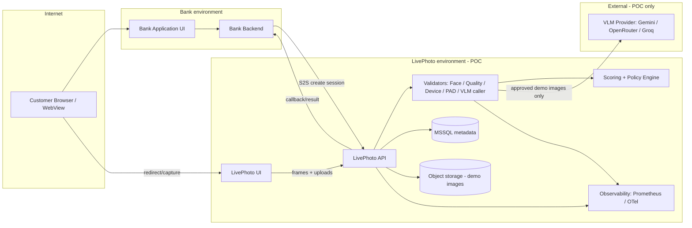
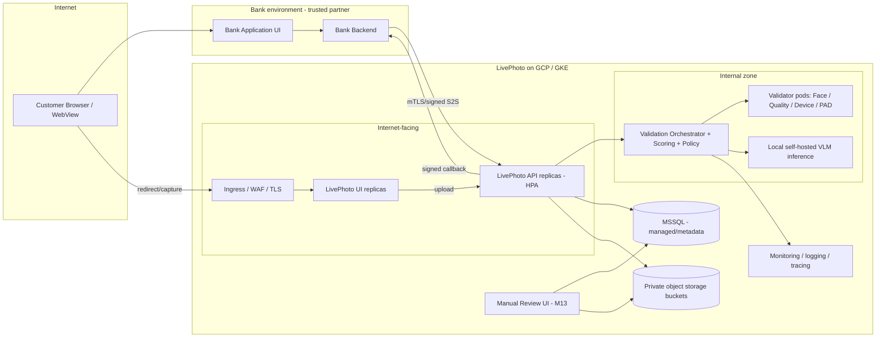

# LivePhoto — System Context (M0 Baseline)

Status: M0 baseline. Shows *what* exists and *where trust boundaries lie*, not a service topology
mandate. Per `ARCHITECTURE_PRINCIPLES.md` P14, this is a **modular monolith** first; the boxes
below are modules/components, most of which start inside one deployable backend with an optionally
separated inference process.

---

## 1. Component map

| Component | Responsibility | Trust zone |
|---|---|---|
| Bank Application UI | Bank-owned customer journey; redirects into/out of LivePhoto | Bank / Internet |
| Bank Backend | Creates sessions (S2S), receives results | Bank |
| LivePhoto UI | React SPA: camera access, capture guidance, client-side UX screening, preview, redirect | Public / Internet (untrusted) |
| LivePhoto API (backend) | Session lifecycle, capture intake, orchestrates validation, decision, persistence, callbacks | Service (Internet-facing edge) |
| Validation services (validators) | Face, quality, device/screen, PAD, VLM callers; emit normalized `ValidationResult` | Internal service zone |
| Scoring / Policy engine | Maps validator evidence to `PASS/RETRY/REVIEW/FAIL` | Internal service zone |
| MSSQL | Metadata, decisions, audit, review, version registries | Internal data zone |
| Object storage | Encrypted private buckets for frames/final images (never public) | Internal data zone |
| VLM provider (external) | POC/demo only, approved non-sensitive images (Gemini/OpenRouter/Groq) | External (POC) |
| Local inference (future) | Self-hosted production model | Internal service zone |
| Observability | Prometheus/OpenTelemetry/structured logs/dashboards | Internal |
| Manual review (future, M13) | Human review of REVIEW cases | Internal, restricted |

## 2. POC architecture



Notes:

- POC may run LivePhoto UI + API in one developer/GCP project; MSSQL may start as a managed single
  instance. This is acceptable for POC and does not invalidate the production topology.
- External VLM is reached only from the POC environment and only for approved demo data
  (`DATA_GOVERNANCE.md`).
- Manual review is absent in POC; REVIEW cases are surfaced as exported review lists.

## 3. Target production architecture



Readiness/liveness probes, PodDisruptionBudgets, resource requests/limits, HPA, secrets
management, network policies, TLS, artifact registry, and centralized logging are all production
requirements — see `NON_FUNCTIONAL_REQUIREMENTS.md`, `SECURITY_REQUIREMENTS.md`. No manifests are
created in M0.

## 4. Trust boundaries

| Boundary | Between | Trust posture | Key controls |
|---|---|---|---|
| TB-1 | Customer browser/WebView ↔ LivePhoto (UI/API) | **Untrusted** | TLS; opaque tokens; no PII in URLs; rate limits; CSP/CORS; server authority |
| TB-2 | Bank UI/Backend ↔ LivePhoto API | **Semi-trusted peer** (authenticated S2S) | Client credentials/mTLS; allow-list; idempotency; signed callbacks; redirect allow-list |
| TB-3 | Internet-facing API ↔ internal orchestrator/validators | Trusted after authN/authZ at edge | Network policy; service identity; least privilege |
| TB-4 | LivePhoto ↔ External VLM (POC only) | External, not trusted for production biometrics | Only demo images; egress restriction; approval; no bank test/prod data |
| TB-5 | MSSQL / object storage | Internal, restricted | Private buckets; encryption; no public URLs; least-privilege service accounts |
| TB-6 | Manual reviewer ↔ review data (future) | Internal, human, audited | Role-based access; audit log; privacy minimisation |
| TB-7 | Observability ↔ data plane | Internal | No raw PII/biometrics in logs/labels; structured redaction |

The authoritative decision is produced inside the LivePhoto **backend** (TB-1 side never decides)
and is delivered to the bank across TB-2 by authenticated channels only
(`API_CONTRACT.md` §Result delivery).

## 5. Deployment evolution (not microservices by default)

Initial runnable shape (from M1/M2):

```
LivePhoto UI (React SPA)
LivePhoto Backend (FastAPI modular monolith: sessions, capture, orchestrator,
                    scoring, policy, callbacks, persistence)
MSSQL metadata
Object storage
```

The validation orchestrator and model inference are separated into an independently scalable
inference process/service **only when justified** by GPU requirements, security boundary needs,
or measured scaling pressure. Inference scalability is required to remain possible from day one
(see `NON_FUNCTIONAL_REQUIREMENTS.md`), which is why validator registration is by-name/config and
the orchestrator calls validators through one interface.

## 6. Configuration catalogue (externalised, versioned)

Anything likely to change is configuration, not source. Initial categories:

| Category | Examples | Version registry |
|---|---|---|
| Capture | frame count (6–12), burst duration (1–2 s), resolution target, max retry attempts | `capture_config_version` |
| Quality/face | blur/exposure thresholds, min face size, face-count rule, occlusion policy | `threshold_version` |
| Validators | enable/disable, per-validator thresholds, timeouts, weight/priority | `threshold_version` / feature flags |
| Models | model ids, provider, image size, `temperature`/sampling | `model_version` (+ `prompt_version`) |
| Vision provider | provider selection, endpoint, key ref, timeout, retry count | application config (secret refs) |
| Callback | callback URL allow-list, timeout, retry schedule | application config |
| Session | expiry duration, single-use semantics, max captures per session | `policy_version` |
| Retention | image retention period, deletion states | `policy_version` (bank-confirmed) |
| Decision policy | outcome mapping rules, REVIEW eligibility | `policy_version` |

Every decision row records the version set that produced it (`DATA_MODEL.md`,
`VALIDATION_PIPELINE.md` §Versioning).

## 7. Open stakeholder questions

Recorded for the bank/compliance/security/infra owners. These are genuine open items, not
deferred design decisions (design decisions live in `docs/adr/`).

1. Production SQL Server deployment model (managed GCP SQL Server vs bank-managed; region).
2. Exact biometric retention period(s) and deletion SLA (legal/compliance).
3. RPO/RTO targets and backup expectations.
4. Bank authentication standard for S2S (mTLS? OAuth client-credentials? signed requests?).
5. Bank callback authentication mechanism and endpoint ownership.
6. Production ingress/WAF standard (bank-mandated WAF vendor/config?).
7. Bank-approved object storage (GCS acceptable?).
8. Self-hosted VLM/model choice and GPU availability for production.
9. Final manual-review SLA and staffing model (M13).
10. Exact supported browser/OS versions matrix (bank device policy).
11. Whether bank test-environment spoof dataset may include real customer-derived images at all,
    and under which approvals.
12. Regulatory mapping owner (which bank team asserts RBI/DPDP/other applicability).
13. DevTools/virtual-camera posture expectations for the *device* channel (bank-owned devices vs
    BYOD) — affects future digital-injection controls.

These must be answered (or explicitly parked with an owner) before the corresponding milestone's
entry criteria are met; they do **not** block M1.
